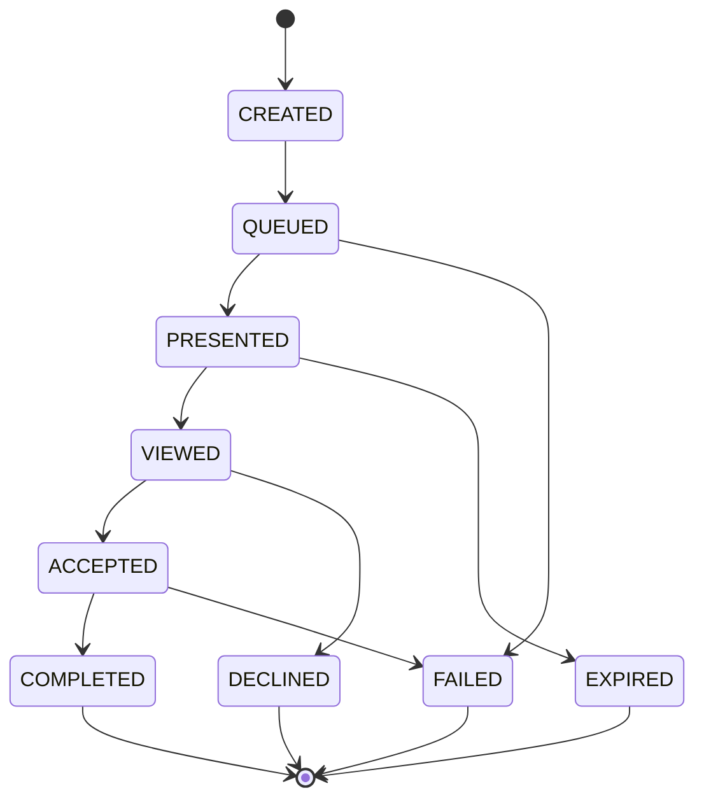
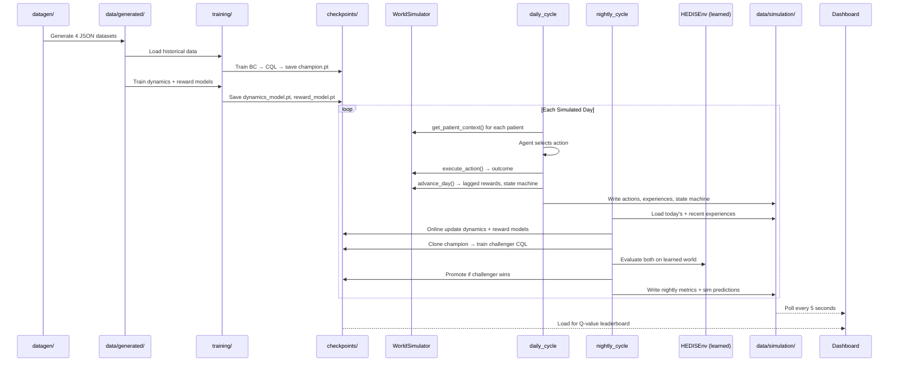

# HEDIS STARS Gap Closure — RL Agent Framework

An offline reinforcement learning system that optimizes omnichannel patient outreach for Medicare Advantage STARS gap closure. The agent learns **which messages to send, through which channels, to which patients — and critically, when to stay silent**. It balances a dual objective: closing HEDIS care gaps to achieve a STARS rating above 4.0 for CMS bonus payments, while conserving a finite per-patient message budget to reduce fatigue and preserve outreach capacity for high-impact moments.

## Problem

Medicare Advantage health plans are rated on a 1–5 star scale by CMS based on quality measures (HEDIS). Plans scoring **≥ 4.0 stars** receive bonus payments worth millions in additional revenue. Closing care gaps — ensuring patients complete screenings, maintain medication adherence, manage chronic conditions — is the primary lever for improving STARS scores.

Today, outreach is rule-based: static campaign schedules push the same messages regardless of patient context. This project replaces that with a **Conservative Q-Learning (CQL) agent** that learns an optimal outreach policy from historical data, respects real-world constraints (opt-outs, contact limits, channel availability), and continuously improves through nightly Dyna-style incremental updates.

## Objective

Train and deploy an RL agent that:

1. **Selects the best action** (measure × channel × content variant) for each patient each day
2. **Learns when to do nothing** — each patient has a finite message budget (12/quarter, 45/year); the agent conserves messages for high-impact moments
3. **Respects eligibility constraints** — SMS consent, app install status, contact frequency limits (3/week), suppression rules, budget exhaustion
4. **Handles lagged rewards** — gap closures may occur weeks after outreach; a learned reward model bridges the delay
5. **Improves nightly** — Dyna-style updates mix fresh daily experiences with historical replay, champion/challenger evaluation gates promotions
6. **Targets STARS ≥ 4.0** — CMS methodology: each measure gets an individual star rating from cut points, weighted average produces overall score

## Quick Start

```bash
# Install
pip install -e ".[dev]"

# Run everything — generates data, starts dashboard, runs 90-day simulation
./run.sh

# Open in your browser
open http://localhost:8050
```

## `run.sh` Reference

```bash
./run.sh                 # Full start (same as ./run.sh start)
./run.sh start           # Stop existing → generate data if needed → start dashboard + simulation
./run.sh stop            # Gracefully stop all processes (auto-cleans stale PIDs)
./run.sh restart         # Stop + fresh start (wipes simulation data)
./run.sh hot             # Hot-restart dashboard only (simulation keeps running)
./run.sh status          # Show what's running, current STARS score, simulation day
./run.sh dashboard       # Start only the dashboard
./run.sh simulate        # Start only the simulation (data must exist)
./run.sh generate        # Generate 5,000-patient mock dataset
./run.sh logs            # tail -f the simulation log
./run.sh clean           # Stop everything + wipe all generated data
```

## Script Entry Points

Each script in `scripts/` can be run standalone with arguments:

```bash
# Data generation
python scripts/generate_data.py --cohort-size 5000 --seed 42

# Train world models (dynamics + reward)
python scripts/train_world_models.py --epochs 50 --batch-size 256

# Train the RL agent (BC warm-start → Actor-Critic CQL)
python scripts/train_agent.py --bc-epochs 50 --cql-epochs 100
python scripts/train_agent.py --skip-bc --cql-epochs 100    # Skip BC if checkpoint exists

# Run simulation
python scripts/run_simulation.py --days 90 --bc-epochs 30 --cql-epochs 10 --eval-episodes 50
python scripts/run_simulation.py --days 5 --bc-epochs 5 --cql-epochs 3 --eval-episodes 10  # Quick test

# Start dashboard
python scripts/run_dashboard.py --port 8050 --debug

# Run test suite (212 tests)
python -m pytest tests/ -v
python -m pytest tests/test_training.py -v     # Just training tests
python -m pytest tests/ -x --tb=short          # Stop on first failure
```

## Using the Model Programmatically

### Train on Your Own Data

```python
from training.data_loader import build_offline_episodes
from training.behavior_cloning import train_behavior_cloning
from training.cql_trainer import train_cql

# Your data must be lists of dicts matching these schemas (see "Input Data Format" below)
import json
with open("your_state_features.json") as f:
    state_features = json.load(f)
with open("your_historical_activity.json") as f:
    historical_activity = json.load(f)
with open("your_action_eligibility.json") as f:
    action_eligibility = json.load(f)

# Convert to offline RL episodes
episodes = build_offline_episodes(state_features, historical_activity, action_eligibility)

# Phase 1: Behavior Cloning (learn from what the business was doing)
bc_policy = train_behavior_cloning(episodes=episodes, epochs=50)

# Phase 2: Actor-Critic CQL (improve on the behavioral policy)
agent = train_cql(episodes=episodes, bc_policy=bc_policy, epochs=100)

# Save
import torch
torch.save(agent.state_dict(), "my_agent.pt")
```

### Load and Use a Trained Agent

```python
import numpy as np
from training.cql_trainer import ActorCriticCQL
from environment.state_space import snapshot_to_vector
from environment.action_masking import compute_action_mask
from environment.action_space import decode_action
import torch

# Load trained agent
agent = ActorCriticCQL()
agent.load_state_dict(torch.load("training/checkpoints/champion.pt", weights_only=True))

# Build patient state vector from your data
patient = {
    "demographics": {"age": 72, "sex": "F", "zip3": "331", "dual_eligible": False,
                     "lis_status": False, "snp_flag": False},
    "clinical": {"bp_systolic_last": 142, "bp_diastolic_last": 88, "a1c_last": 8.2,
                 "bmi": 31.4, "ckd_stage": 2, "phq9_score": 6,
                 "conditions": {"diabetes": True, "hypertension": True, "hyperlipidemia": True,
                                "depression": False, "ckd": True, "chd": False, "copd": False, "chf": False}},
    "medication_fill_rates": {"statin": 0.82, "ace_arb": 0.91, "diabetes_oral": 0.75, "antidepressant": 0.0},
    "open_gaps": ["COL", "EED", "CBP", "MDS"],
    "closed_gaps": ["BCS", "FLU", "FVA"],
    "engagement": {"sms_consent": True, "email_available": True, "portal_registered": True,
                   "app_installed": False, "preferred_channel": "sms",
                   "total_contacts_90d": 5, "sms_response_rate": 0.6, "email_open_rate": 0.3,
                   "portal_engagement_rate": 0.4, "app_engagement_rate": 0.0,
                   "ivr_completion_rate": 0.15, "last_contact_date": "2026-03-01",
                   "days_since_last_contact": 14},
    "risk_scores": {"readmission_risk": 0.12, "disenrollment_risk": 0.05,
                    "non_compliance_risk": 0.35, "composite_acuity": 2.8},
}

state_vec = snapshot_to_vector(patient, budget_remaining=8, budget_max=12)

# Compute action mask
mask = compute_action_mask(
    open_gaps=set(patient["open_gaps"]),
    channel_availability={"sms": True, "email": True, "portal": True, "app": False, "ivr": True},
    budget_remaining=8,
)

# Get the agent's recommended action
action_id = agent.get_action_greedy(state_vec, mask.astype(np.float32))
action = decode_action(action_id)
print(f"Recommended: {action.measure} via {action.channel} — {action.variant}")
# → e.g., "Recommended: MDS via sms — refill_reminder"
```

### Inspect Q-Values for All Valid Actions

```python
import torch

# Get Q-values from the twin critics (conservative = min of both)
agent.critic.eval()
with torch.no_grad():
    state_t = torch.FloatTensor(state_vec).unsqueeze(0)
    q_min = agent.critic.q_min(state_t).squeeze()

# Show top actions by Q-value
from config import ACTION_BY_ID
valid_indices = np.where(mask)[0]
q_valid = [(int(i), float(q_min[i]), ACTION_BY_ID[i]) for i in valid_indices if i > 0]
q_valid.sort(key=lambda x: x[1], reverse=True)

for idx, qval, act in q_valid[:10]:
    print(f"  Q={qval:+.4f}  {act.measure} | {act.channel} | {act.variant}")
```

### Evaluate a Model on the Gym Environment

```python
from training.evaluation import evaluate_agent
from environment.hedis_env import HEDISEnv

env = HEDISEnv(state_features, action_eligibility)
metrics = evaluate_agent(agent, env, n_episodes=500)
print(f"Mean reward: {metrics['mean_reward']:.4f}")
print(f"Gaps closed: {metrics['mean_gaps_closed']:.1f}")
print(f"No-action rate: {metrics['no_action_rate']:.1%}")
```

### Run the Gym Environment for Model Evaluation

```python
import json
import numpy as np
from environment.hedis_env import HEDISEnv
from training.cql_trainer import ActorCriticCQL
from training.evaluation import evaluate_agent
import torch

# Load data and model
with open("data/generated/state_features.json") as f:
    patients = json.load(f)
with open("data/generated/action_eligibility.json") as f:
    eligibility = json.load(f)

agent = ActorCriticCQL()
agent.load_state_dict(torch.load("training/checkpoints/champion.pt", weights_only=True))

# Create environment
env = HEDISEnv(patients, eligibility, max_steps_per_episode=30)

# Option 1: Quick evaluation across many episodes
metrics = evaluate_agent(agent, env, n_episodes=500, seed=42)
print(f"Mean reward:     {metrics['mean_reward']:.4f}")
print(f"Std reward:      {metrics['std_reward']:.4f}")
print(f"Gaps closed/ep:  {metrics['mean_gaps_closed']:.1f}")
print(f"No-action rate:  {metrics['no_action_rate']:.1%}")
print(f"Avg ep length:   {metrics['mean_episode_length']:.0f}")

# Option 2: Manual rollout to inspect agent behavior step by step
obs, info = env.reset(seed=42, options={"patient_idx": 0, "day_of_year": 100})
print(f"\nPatient: {info['patient_id']}, Open gaps: {info['open_gaps']}")

done = False
while not done:
    state = obs["observations"]
    mask = obs["action_mask"]
    action_id = agent.get_action_greedy(state, mask.astype(np.float32))

    obs, reward, terminated, truncated, info = env.step(action_id)
    done = terminated or truncated

    if info["measure"]:
        print(f"  Day {info['day_of_year']}: {info['measure']} via {info['channel']} "
              f"→ {'CLICKED' if info['clicked'] else 'delivered' if info['delivered'] else 'sent'} "
              f"(r={reward:+.3f}, gaps_left={len(info['open_gaps'])}, "
              f"budget={info['budget_remaining']})")
    else:
        print(f"  Day {info['day_of_year']}: no_action (r={reward:+.3f})")

print(f"\nEpisode reward: {info['episode_reward']:.3f}")
```

### Compare Two Models (Champion vs Challenger)

```python
from training.evaluation import evaluate_agent, compare_models

champion_metrics = evaluate_agent(champion_agent, env, n_episodes=200, seed=42)
challenger_metrics = evaluate_agent(challenger_agent, env, n_episodes=200, seed=42)

result = compare_models(champion_metrics, challenger_metrics, improvement_threshold=0.02)
print(f"Champion:   {result['champion_mean_reward']:.4f}")
print(f"Challenger: {result['challenger_mean_reward']:.4f}")
print(f"Improve:    {result['relative_improvement']:.1%}")
print(f"Promote:    {result['promote_challenger']}")
```

## Input Data Format

To train on your own data, prepare four JSON files matching these schemas:

### `state_features.json` — Patient Snapshots

```json
[
  {
    "patient_id": "P10042",
    "demographics": {"age": 72, "sex": "F", "zip3": "331", "dual_eligible": false,
                     "lis_status": false, "snp_flag": false},
    "clinical": {"bp_systolic_last": 142.0, "bp_diastolic_last": 88.0, "a1c_last": 8.2,
                 "bmi": 31.4, "ckd_stage": 2, "phq9_score": 6,
                 "conditions": {"diabetes": true, "hypertension": true, "hyperlipidemia": true,
                                "depression": false, "ckd": true, "chd": false, "copd": false, "chf": false}},
    "medication_fill_rates": {"statin": 0.82, "ace_arb": 0.91, "diabetes_oral": 0.75, "antidepressant": 0.0},
    "open_gaps": ["COL", "EED", "CBP", "MDS"],
    "closed_gaps": ["BCS", "FLU"],
    "engagement": {"sms_consent": true, "email_available": true, "portal_registered": false,
                   "app_installed": false, "preferred_channel": "sms", "total_contacts_90d": 5,
                   "sms_response_rate": 0.6, "email_open_rate": 0.3, "portal_engagement_rate": 0.0,
                   "app_engagement_rate": 0.0, "ivr_completion_rate": 0.15,
                   "last_contact_date": "2026-03-01", "days_since_last_contact": 14},
    "risk_scores": {"readmission_risk": 0.12, "disenrollment_risk": 0.05,
                    "non_compliance_risk": 0.35, "composite_acuity": 2.8}
  }
]
```

### `historical_activity.json` — Past Outreach Records

```json
[
  {
    "record_id": "act_000001",
    "patient_id": "P10042",
    "date": "2025-03-15",
    "action_id": 5,
    "measure": "COL",
    "channel": "sms",
    "variant": "scheduling_link",
    "outcome": {
      "delivered": true,
      "opened": true,
      "clicked": false,
      "gap_closed_within_30d": false,
      "gap_closed_within_90d": true,
      "days_to_closure": 47
    },
    "context": {
      "prior_attempts_this_measure": 2,
      "days_since_last_contact": 14,
      "member_tenure_months": 36
    }
  }
]
```

The `action_id` must match an entry in the action catalog (see `config.py`). The `outcome` fields provide the reward signal for BC and CQL training.

### `action_eligibility.json` — Constraint Snapshots

```json
[
  {
    "patient_id": "P10042",
    "snapshot_date": "2026-01-15",
    "action_mask": [true, true, false, true, ...],
    "global_constraints": {
      "opt_out": false,
      "grievance_hold": false,
      "suppression_active": false,
      "max_contacts_per_week": 3,
      "contacts_this_week": 1
    },
    "eligible_measures": ["COL", "EED", "CBP", "MDS"]
  }
]
```

The `action_mask` is a boolean array of length 125 (one per action). Index 0 (`no_action`) must always be `true`.

## HEDIS Measures & CMS STARS Methodology

### 18 Part C Measures

| Measure | Description | CMS Weight | 4★ Cut Point |
|---------|-------------|:---:|:---:|
| COL | Colorectal Cancer Screening | 1 | 70% |
| BCS | Breast Cancer Screening | 3 | 78% |
| EED | Eye Exam for Diabetics | 3 | 75% |
| FVA | Adult Immunization — Tdap | 1 | 55% |
| FVO | Pneumococcal Vaccination | 1 | 65% |
| AIS | Adult Immunization — Zoster | 1 | 45% |
| FLU | Influenza Vaccination | 1 | 73% |
| CBP | Controlling Blood Pressure | 3 | 78% |
| BPD | BP Control for Diabetics | 3 | 72% |
| HBD | A1C Control for Diabetics | 3 | 84% |
| KED | Kidney Health Evaluation | 1 | 62% |
| MAC | Medication Adherence — Statins | 3 | 89% |
| MRA | Medication Adherence — RAS Antagonists | 3 | 89% |
| MDS | Medication Adherence — Diabetes | 3 | 87% |
| DSF | Depression Screening & Follow-Up | 1 | 65% |
| DRR | Depression Remission/Response | 1 | 40% |
| DMC02 | Antidepressant Medication Management | 3 | 65% |
| TRC_M | Transitions of Care — Med Reconciliation | 1 | 60% |

### STARS Calculation (CMS Methodology)

1. Each measure's performance rate is converted to an individual 1–5 star rating using measure-specific cut points
2. The overall rating is the **weighted average** of individual measure stars
3. Weights: Outcome/Intermediate Outcome = 3, Process/New = 1

## Action Space (125 Curated Actions)

Each action is a realistic **(measure, channel, content_variant)** tuple. 5 channels × 18 measures with curated variants, plus no_action.

| Category | Channel | Variant | Example |
|----------|---------|---------|---------|
| Screening | SMS | `scheduling_link` | "Book your colonoscopy — tap here" |
| Screening | SMS | `incentive_offer` | "$50 reward when you complete screening" |
| Vaccine | SMS | `pharmacy_locator` | "Get your flu shot free at CVS near you" |
| Med Adherence | SMS | `refill_reminder` | "Time to refill your statin — tap to order" |
| Med Adherence | App | `adherence_gamification` | Streak tracker + reward milestones |
| Chronic Mgmt | SMS | `home_device_offer` | "Free BP monitor — reply YES" |
| Mental Health | Portal | `screening_tool` | In-portal PHQ-9 questionnaire |
| Care Transition | IVR | `care_navigator` | Automated call → live transfer to nurse |

Action 0 is always `no_action` — the agent can choose strategic silence.

## Patient Archetypes (12 Behavioral Segments)

Mock data is generated from 12 latent patient archetypes. Each archetype defines a behavioral profile — channel preferences, measure responsiveness, timing sensitivity, and overall engagement level. The RL model must discover these segments from the data and learn to match actions to patient types.

| # | Archetype | % | Best Channel | Best Measures | Behavior |
|:-:|-----------|:-:|-------------|--------------|----------|
| 1 | **Digital Native** | 8% | App, Portal | Med adherence, Screenings | Younger MA member, tech-savvy, uses app daily. Responds to gamification and in-app refill tools. |
| 2 | **Proactive Health Manager** | 10% | Email, Portal | Screenings, Vaccines, Chronic | Self-directed. Reads educational content. Books own appointments from email links. |
| 3 | **SMS-First Responder** | 12% | SMS | Vaccines, Med adherence | Only reads texts. Ignores email and app notifications entirely. Short scheduling links work best. |
| 4 | **Refill Reminder Responder** | 10% | SMS | Med adherence (**2.2×** boost) | Responds ONLY to refill reminders. Ignores screening/education content. |
| 5 | **Phone Caller** | 8% | IVR | Care coordination, Vaccines | Older (80+), prefers voice calls. Distrusts digital. Answers IVR and talks to care navigators. |
| 6 | **Diabetic Engager** | 10% | SMS, App | Chronic (**2.0×**), Med adherence | Diabetic who responds to condition-specific outreach. Likes home monitoring offers. |
| 7 | **Cardiac Risk Patient** | 8% | Email, IVR | Chronic (**1.8×**), Med adherence | High CHD/CHF risk. Responds to BP and cholesterol management. Needs care coordination. |
| 8 | **Behavioral Health Seeker** | 6% | Portal, App | Mental health (**2.5×**!) | Depression/anxiety. Prefers privacy of portal. Responds to telehealth links and PHQ-9 screening tools. |
| 9 | **Passive Ignorer** | 10% | None (all < 15%) | All low | Rarely responds to any channel. Best strategy: skip this patient and conserve budget. |
| 10 | **Incentive-Motivated** | 6% | SMS | Screenings (via incentive_offer **3×**) | Only responds to financial incentives ($50 offers, free devices). Ignores educational content. |
| 11 | **New Enrollee** | 6% | Mixed | All moderate | Recently enrolled, many open gaps, unknown preferences. Welcome window — responds well if contacted early. |
| 12 | **Post-Discharge Complex** | 6% | IVR | Care coordination (**2.5×**) | Recently hospitalized, high readmission risk. Needs immediate IVR follow-up and care navigator transfer. |

**How archetypes create learnable structure:**

Each archetype has specific distributions for:
- **Channel affinity** — probability of opening/clicking per channel (e.g., Digital Native: app 85%, IVR 10%)
- **Channel engagement** — conversion rate per channel (e.g., Phone Caller: IVR 50%, email 5%)
- **Overall responsiveness** — base engagement multiplier (Proactive: 0.70, Passive: 0.12)
- **Timing sensitivity** — optimal contact interval and decay for over-contact (Phone Caller: 21 days, Passive: 30 days)
- **Measure category boost** — multiplier on gap closure probability per measure type (Refill Responder: med adherence 2.2×, screenings 0.7×)
- **Variant boost** — some archetypes only respond to specific content types (Incentive-Motivated: `incentive_offer` 3×, `zero_cost_reminder` 2×)

The model that learns these patterns will:
- Send **app refill reminders** to Digital Natives
- Send **SMS pharmacy locators** to SMS-First Responders
- Send **portal PHQ-9 screening tools** to Behavioral Health Seekers
- Send **IVR care navigator transfers** to Post-Discharge Complex patients
- **Skip** Passive Ignorers entirely (conserve global budget)
- Send **$50 incentive offers** (not educational content) to Incentive-Motivated patients

## Model Architecture — Actor-Critic CQL

```mermaid
graph TD
    S[State Vector 96-dim] --> A[Actor Network<br/>96→256→256→125<br/>Masked Softmax π&#40;a|s&#41;]
    S --> Q1[Critic Q1<br/>96→256→256→125]
    S --> Q2[Critic Q2<br/>96→256→256→125]
    Q1 --> MIN[Q = min&#40;Q1, Q2&#41;<br/>Conservative Estimate]
    Q2 --> MIN
    MIN --> CQL[CQL Penalty<br/>LogSumExp&#40;Q_valid&#41; − Q&#40;s, a_data&#41;]
    A --> ACTION[Selected Action]
    MASK[Action Mask<br/>125 booleans] --> A
```

**Training pipeline:**
1. **World Models** — train dynamics model (next state prediction) and reward model (gap closure prediction) on historical data
2. **Behavior Cloning** — initialize actor from historical outreach data
3. **CQL Fine-Tuning** — conservative offline RL with SAC backbone + twin critics
4. **Nightly Dyna Updates** — fresh daily experience + 5% historical replay + recent 3 days, quick 5-epoch update on CQL agent + online updates to dynamics/reward models, champion/challenger evaluation on learned world (HEDISEnv)

## Reward Function

Simplified for clear learning signal:

```
R(s, a) = gap_closure × measure_weight    (1 or 3 for triple-weighted measures)
         + 0.05 × clicked                  (small engagement bonus)
         − 0.002                            (tiny action cost to prefer silence over spam)
```

No-action = 0 reward. Budget constraint is handled by action masking (global budget exhaustion), not reward penalties.

## Message Budget

**Global shared pool**: `30 × cohort_size` messages for the quarter (150k for 5k patients). The agent decides allocation — some patients get 40+ messages, others get 2. When budget hits 0, all actions are masked for all patients.

The agent sees 10 budget/contact features in the state vector:
- Global budget remaining (normalized), utilization rate, warning/critical flags
- Per-patient: messages received vs average, historical response rate, gap urgency, days since last closure, channel diversity

## Action Lifecycle State Machine



Channel-specific transition probabilities (e.g., SMS: 95% delivery, 82% open; IVR: 70% delivery, 20% acceptance). Feeds engagement signals back to the simulation.

## Dashboard (6 Tabs)

| Tab | Content |
|-----|---------|
| **STARS Overview** | Gauge (target 4.0), trajectory, cumulative reward, regret curve, gap closure heatmap by measure, per-measure table with CMS cut points + progress bars + individual star ratings |
| **Live Behavior** | Global budget gauge (shared pool), action leaderboard (toggle: Q-value / acceptance / completion), Sankey lifecycle flow, action funnel, channel/measure distributions, recent actions + state transitions |
| **Training & Simulation** | Champion vs challenger reward curves, model version timeline, promotion history. **Learned world predictions**: predicted action mix, closure rates by measure, channel effectiveness, STARS projection — "what happens if we deploy this model tomorrow" |
| **Measures** | Channel × measure effectiveness heatmap, per-measure closure trend with 4★/5★ CMS cut point lines, per-measure lifecycle funnel |
| **Patient Journey** | Interactive action cards (channel icons, measure badges, disposition 👍/👁️/📬/👎), messages received vs cohort average, cumulative reward curve |
| **Logs** | Real-time simulation log stream with level filtering (PHASE, METRIC, INFO, ERROR) |

## Tests

```bash
python -m pytest tests/ -v                    # Full suite (212 tests)
python -m pytest tests/test_datagen.py -v     # Data schema + clinical range validation
python -m pytest tests/test_environment.py -v # Action masking, OOD, reward, gym env
python -m pytest tests/test_training.py -v    # BC, CQL actor-critic, twin critics, eval
python -m pytest tests/test_simulation.py -v  # Daily/nightly cycles, state machine, metrics
python -m pytest tests/test_integration.py -v # End-to-end, world models, edge cases
```

## Dependencies

```
gymnasium>=0.29.0    torch>=2.0.0     numpy>=1.24.0
pandas>=2.0.0        plotly>=5.18.0   dash>=2.14.0
scipy>=1.11.0        scikit-learn>=1.3.0
```

## System Architecture

```mermaid
graph TB
    subgraph CONFIG["config.py — Central Configuration"]
        C1[18 HEDIS Measures + CMS Cut Points]
        C2[125 Action Catalog]
        C3[12 Patient Archetypes]
        C4[Reward Weights · Budget Params]
    end

    subgraph DATAGEN["datagen/ — Mock Data Generation"]
        DG1[archetypes.py<br/>12 behavioral segments]
        DG2[patients.py<br/>archetype-driven profiles]
        DG3[state_features.py<br/>clinical snapshots]
        DG4[historical_activity.py<br/>200k outreach records]
        DG5[gap_closure.py<br/>longitudinal timelines]
        DG6[action_eligibility.py<br/>constraint masks]
    end

    subgraph MODELS["models/ — Learned World Models"]
        M1[dynamics_model.py<br/>s' = f&#40;s, a&#41; + ε]
        M2[reward_model.py<br/>P&#40;closure | s, a, days&#41;]
    end

    subgraph TRAINING["training/ — RL Pipeline"]
        T1[data_loader.py<br/>JSON → episodes]
        T2[behavior_cloning.py<br/>BC warm-start]
        T3[cql_trainer.py<br/>Actor-Critic CQL]
        T4[evaluation.py<br/>champion vs challenger]
    end

    subgraph ENV["environment/ — Gym Interface"]
        E1[hedis_env.py<br/>Model-based evaluation]
        E2[action_masking.py<br/>business rules]
        E3[state_space.py<br/>96-dim vectors]
        E4[reward.py<br/>gap closure + cost]
    end

    subgraph SIM["simulation/ — 90-Day Loop"]
        S1[loop.py<br/>orchestrator]
        S2[world.py<br/>WorldSimulator]
        S3[daily_cycle.py<br/>agent ↔ world]
        S4[nightly_cycle.py<br/>Dyna-style update]
        S5[action_state_machine.py<br/>lifecycle tracking]
        S6[lagged_rewards.py<br/>delayed closures]
    end

    subgraph DATA["data/ — JSON Store"]
        D1[generated/<br/>patients, history, gaps, eligibility]
        D2[simulation/<br/>daily outputs, metrics, predictions]
        D3[checkpoints/<br/>champion.pt, dynamics.pt, reward.pt]
    end

    subgraph DASH["dashboard/ — Plotly Dash :8050"]
        DA1[STARS Overview]
        DA2[Live Behavior]
        DA3[Training & Simulation]
        DA4[Measures]
        DA5[Patient Journey]
        DA6[Logs]
    end

    CONFIG --> DATAGEN
    CONFIG --> ENV
    CONFIG --> TRAINING
    CONFIG --> SIM

    DATAGEN -->|generates| D1
    D1 -->|loaded by| TRAINING
    D1 -->|loaded by| SIM
    TRAINING -->|produces| D3
    SIM -->|writes daily| D2
    S4 -->|updates| D3
    M1 --> E1
    M2 --> E1
    E1 -->|evaluates| T4
    S2 -->|ground truth| S3
    D2 -->|5s polling| DASH
    D3 -->|Q-values| DASH
```

### Data Flow


